# Bring your own training-completed model with SageMaker by building a custom container


[Amazon SageMaker](https://aws.amazon.com/sagemaker/) provides every developer and data scientist with the ability to build, train, and deploy machine learning models quickly. Amazon SageMaker is a fully-managed service that covers the entire machine learning workflow to label and prepare your data, choose an algorithm, train the model, tune and optimize it for deployment, make predictions, and take action. Your models get to production faster with much less effort and lower cost.

In this session, you will build a custom container which contains a train-completed Pytorch model, and deploy it as a SageMaker endpoint. Your model is trained elsewhere like on premise perhaps, and you only want to use SageMaker to host the model. The session teaches how to do that. Pyorch/fast-ai model is provided for learning purposes. Once you know how to deploy a custom container with SageMaker, you can use the same approach to deploy the model trained with other machine learning framework.


## When should I build my own algorithm container?

You may not need to create a container to bring your own code to Amazon SageMaker. When you are using a framework (such as Apache MXNet or TensorFlow) that has [direct support in SageMaker](https://sagemaker.readthedocs.io/en/stable/), you can simply supply the Python code that implements your algorithm using the SDK entry points for that framework. This set of frameworks is continually expanding, so we recommend that you check the current list if your algorithm is written in a common machine learning environment.

Even if there is direct SDK support for your environment or framework, you may find it more effective to build your own container. If the code that implements your algorithm is quite complex on its own or you need special additions to the framework, building your own container may be the right choice.

If there isn't direct SDK support for your environment, don't worry. You'll see in this walk-through that building your own container is quite straightforward.


## Example

We will show how to package a simple Pytorch image classification model which classifies types of recycle item. For simplification, there are 3 categories of recycle item, paper, glass bottle, and plastic bottle. The model predicts the image passed on is any of the 3 categories.   

The example is purposefully fairly trivial since the point is to show the surrounding structure that you'll want to add to your own code to host it in Amazon SageMaker.

The ideas shown here will work in any language or environment. You'll need to choose the right tools for your environment to serve HTTP requests for inference, but good HTTP environments are available in every language these days.

## Contents of the solution


- **build_and_push.sh** is a script that uses the Dockerfile to build your container images and then pushes it to [Amazon Elastic Container Registry (ECR)](https://aws.amazon.com/ecr/). The argument you pass here will be used as your ECR repository name. 
- **Dockerfile** describes how to build your Docker container image, and specifies which libraries and frameworks to be installed to host your model. If your model is trained with frameworks other than Pytorch and [fastai](https://www.fast.ai/), you will update this file.  
- **lambda_function.py** contains the code that downloads a test image from an [Amazon S3](https://aws.amazon.com/s3/) bucket, and then invokes the SageMaker endpoint sending the image for an inference. You will paste this code to your [Lambda](https://aws.amazon.com/lambda/) function after the endpoint creation is done. 
- **data folder** contains test images. You will upload those images to your S3 bucket.
- **model folder** contains the compressed Pytorch/fastai image classification model. You will upload the tar.gz file to your S3 bucket.
- **image_classification** folder contains the following files that are going to be copied into the Docker image that hosts your model.
    - **nginx.conf** is the configuration file for the nginx front-end. No need to modify this file and use it as-is.
    - **serve** is the program that starts when the container is started for hosting. It simply launches the gunicorn server which runs multiple instances of the Flask app defined in predictor.py. No need to modify this file and use it as-is.
    - **wsgi.py** is a small wrapper used to invoke the Flask app. No need to modify this file and use it as-is.
    - **predictor.py** is the program that actually implements the Flask web server and the image classification predictions. Amazon SageMaker uses two URLs in the container:
        - **/ping** will receive GET requests from the infrastructure. The program returns 200 if the container is up and accepting requests.
        - **/invocations** is the endpoint that receives client’s inference POST requests. The format of the request and the response depends on the algorithm. For this blog post, we will be receiving a JPEG image and the model will classify which type of recycling item it is. It returns the results text in a JSON format.


    

## Prerequisites for the Workshop

- Sign up for an AWS account
- Know how to SSH into an EC2 instance.


## Workshop Roadmap

- **Launch [Amazon EC2](https://aws.amazon.com/ec2/) instance** where you will be building the Docker image and push it to ECR to be ready for use by SageMaker.
- **Create a model object** on SageMaker.
- **Create an endpoint configuration** on SageMaker.
- **Create an endpoint**.
- **Create a Lambda function** to test your endpoint.


## Launch EC2 Instance

1. Click on **EC2** from the list of all services by entering EC2 into the **Find services** box. This will bring you to the EC2 console homepage. 

1. To launch a new EC2 instance, click on the **Launch instance** button. 

    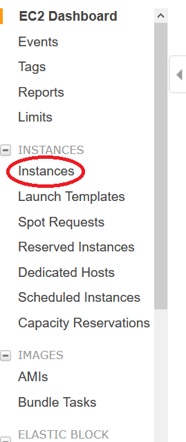

1. Look for Deep Learning AMI (Amazon Linux) by typing *Deep Learning* the searchbox. To choose Deep Learning AMI, click on the blue **Select** button. 

    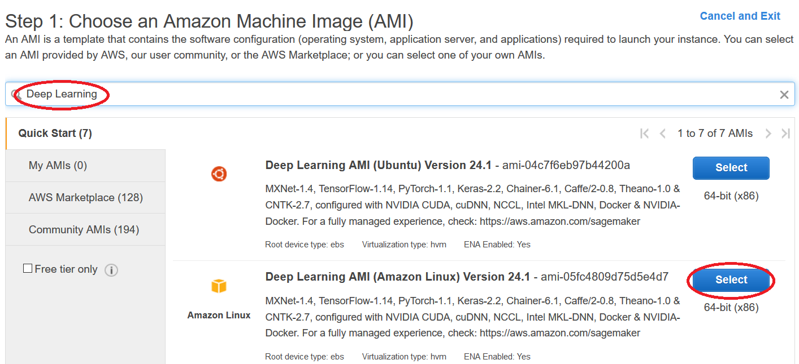

1. If your account allows C instance, choose c5.4xlarge. If not, choose one of m5 instances. Click on **Next: Configure Instance Details** button. 

    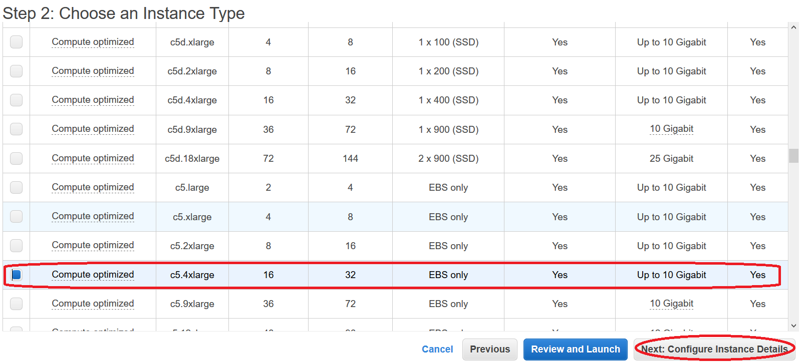

1. No change reuqired on **Step 3: Configure Instance Details**. Click **Next: Add Storage** button. 

    On the **Add Storage** page, make sure to change the storage size to 150 GiB. This is important step as building Docker container will run out of space if you leave as the default value of 75 GiB.

    Click on **Review and Launch** button. 

    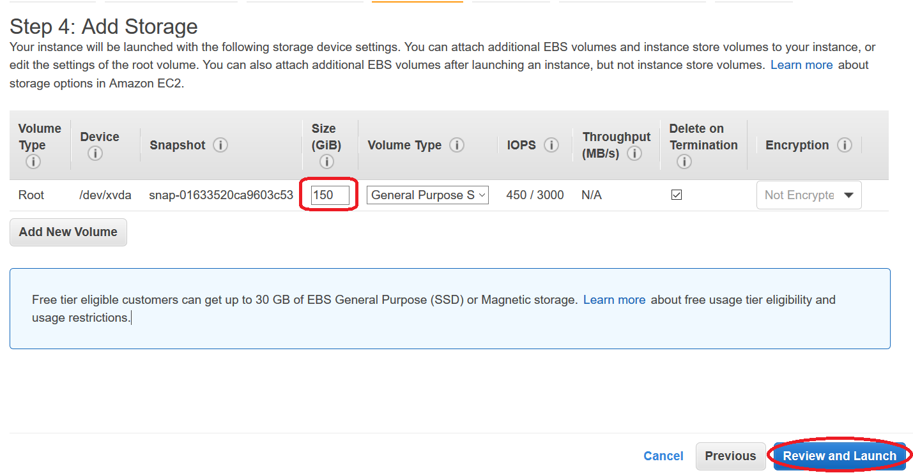

1. On **Step 7: Review Instance Launch**, click on the **Launch** button. It will bring up a **Select key pair window**. Select **Choose existing key pair** if you already have one. Select **Create a new key pair** if you don't have one. 

    

1. It would take a few minutes before the instance is ready for use. Once the status shows *running*, look up IP address from **IPv4 Public IP**. Use that IP address to SSH into the instance along the KeyPair.

    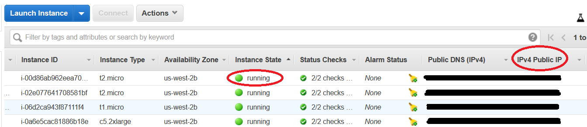

1. After you are logged on your EC2 instance, do the following:

    - Set up your instance to access your AWS account resources, using the following command. You will need **Access Key ID** and **Secret Access Key**. If you don't have them and don't know how to get them, go [here]().  
        ``` 
        aws configure
        ``` 

    - Clone the github repo
       ``` 
        > git clone https://github.com/rumiio/SageMaker_Custom_Container.git
       ``` 
    - Run build_and_push.sh
        ``` 
        >cd SageMaker_Custom_Container     
        >chmod +x build_and_push.sh
        >./build_and_push.sh image_classification_sample
        ```
1. Go to ECR console and see the repo and image that were created by executing **build_and_push.sh** in the previous step. Copy the image URI. We will use this when we create the model object on SageMaker. 

    <account_number>.dkr.ecr.us-west-2.amazonaws.com/image_classification_sample:latest

    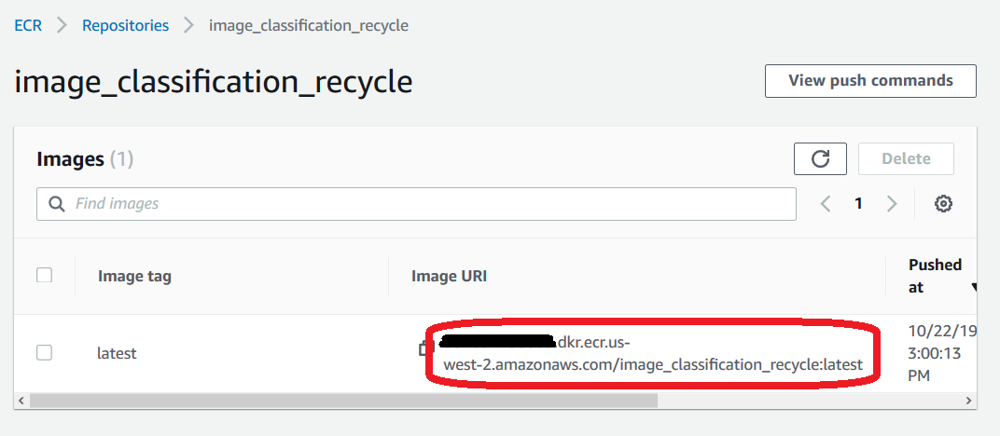

1. Run the following commands to copy the contents of data and model folders to your S3 bucket (the bucket has to be in the same region as the region you will be using SageMaker) 
    ``` 
    aws s3 cp ./data/glass_bottle.jpg s3://your-bucket-name/SageMaker_Custom_Container/data/glass_bottle.jpg
    aws s3 cp ./data/paper.jpg s3://your-bucket-name/SageMaker_Custom_Container/data/paper.jpg
    aws s3 cp ./data/plastic_bottle.jpg s3://your-bucket-name/SageMaker_Custom_Container/data/plastic_bottle.jpg
    aws s3 cp ./model/model.tar.gz s3://your-bucket-name/SageMaker_Custom_Container/model/model.tar.gz
    ``` 

## Create a Model Object on SageMaker

1. On the SageMaker console, go to **Models**, and click on **Create model** button. 

    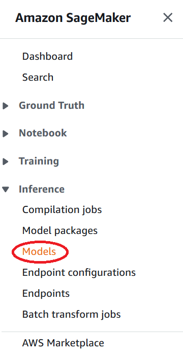

    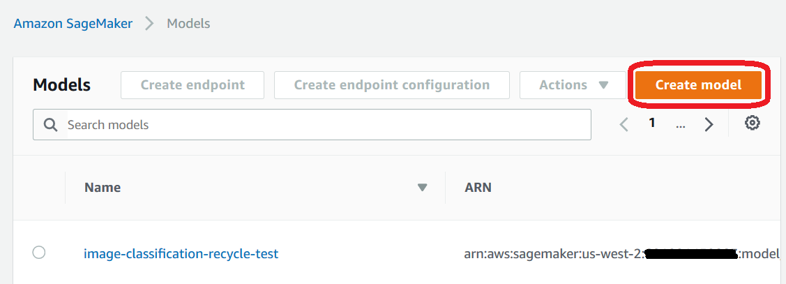

1. Enter model name *image-classification-recycle*. Choose a SageMaker IAM role if you have it. If not, choose **Create a new role**.  

    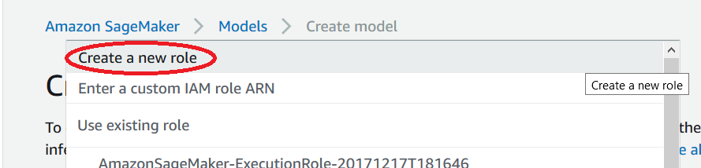

    Scroll down and enter the location of the model arcifacts (S3 location), and container host name which is the image URI you copied in the previous section. Leave everything else blank or as default value. After done entering those values, click on **Create model** button

    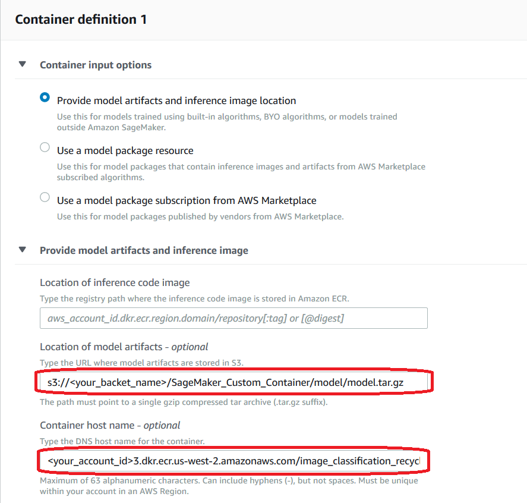


## Create an Endpoint Configuration on SageMaker.

1. On the SageMaker console, go to **Endpoint Configurations**, and click on **Create endpoint configuration** button.  

    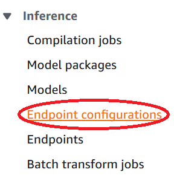

    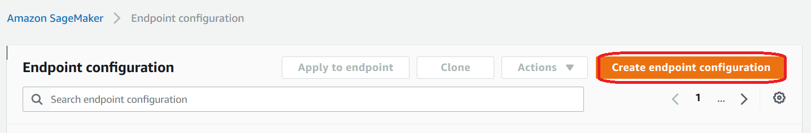

1. Enter Endpoint configuration name, *image-classification-recycle-conf*. Click on the **Add model** button link.  It will bring up a pop up that lists available model objects. Select the one you created in the previous step. Then click on **Create endpoint configuration** button on the bottom of the page.

    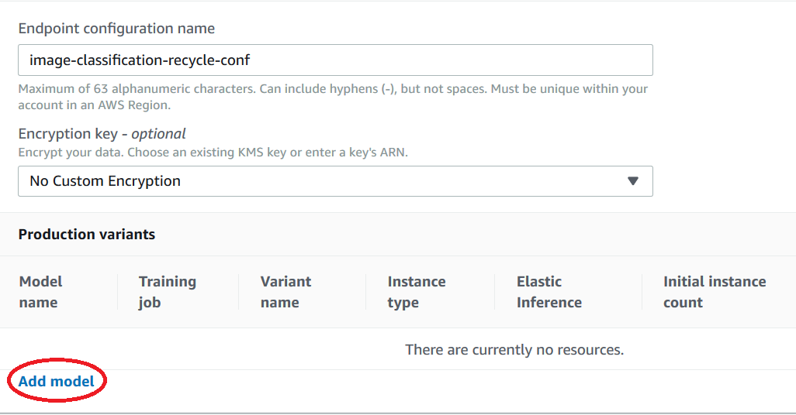


## Create an Endpoint

1. On the SageMaker console, go to **Endpoint**, and click on **Create endpoint** button.

1. Enter endpoint name, *image-classification-recycle*. Choose **Use an existing endpoint configuration** option, and specify endpoint configuration you created in the previous step. Click on **Create endpoint** button on the bottom of the page. 

    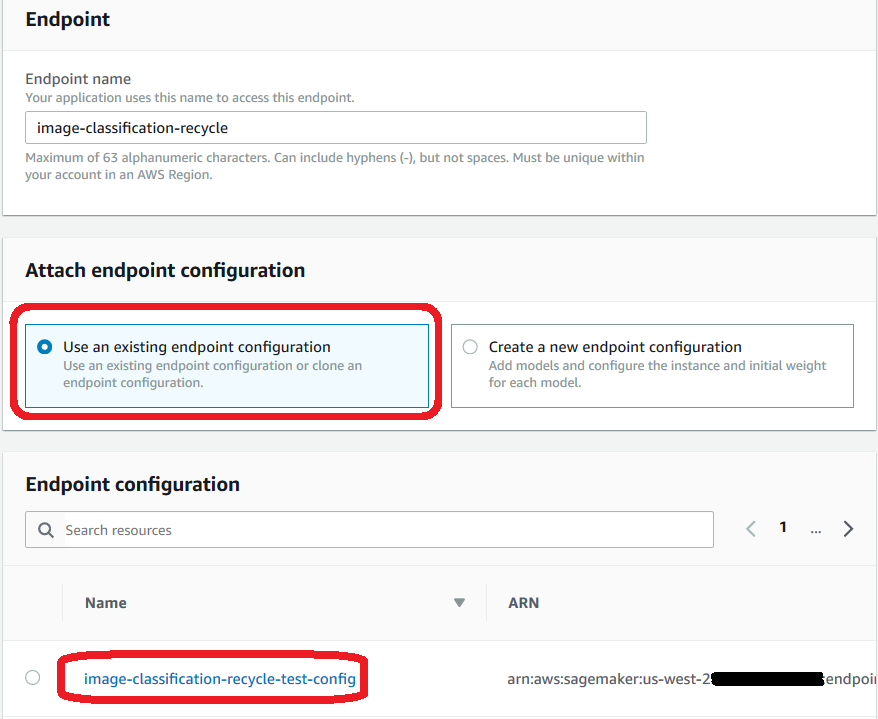


## Create a Lambda Function to Test your Endpoint.

1. Go to the Lambda console, click on **Create function** button.

1. Select **Author from scratch** option, and enter funciton name, *Call-SageMaker-Endpoint-Image-Class*. Choose **Python 3.6** for the Runtime. 

    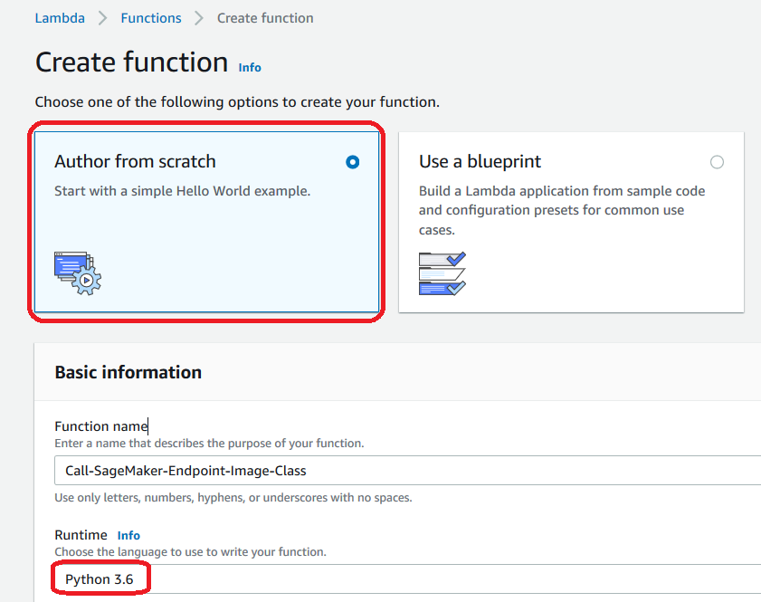

    For the execution role, choose **Create a new role with basic Lambda permissions**. Then click on **Create function** button. 

    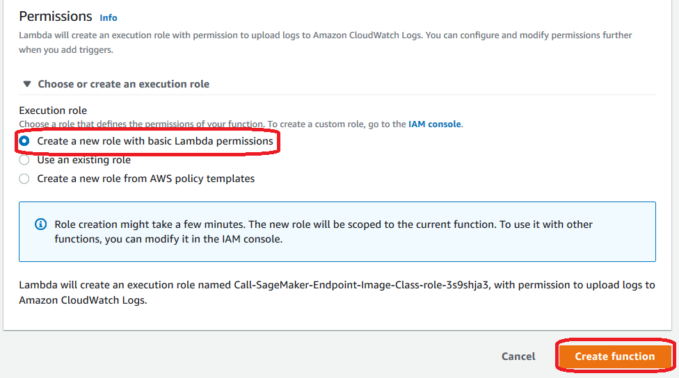

1. After the function is created, scroll down to **Execution role** section and click on the link of **View the Call-SageMaker-Endpoint-Image-Class-role-...** link under the **Existing role** dropdown. It will bring up the IAM console where you will add one policy to the role.   

    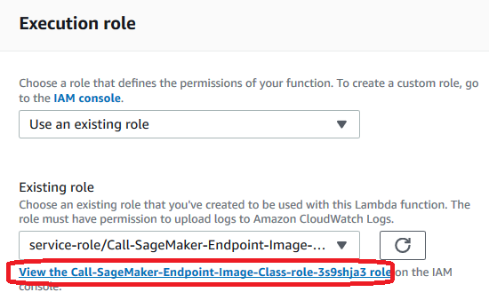

    On the Summry page, click on **Attach policy** button. 

    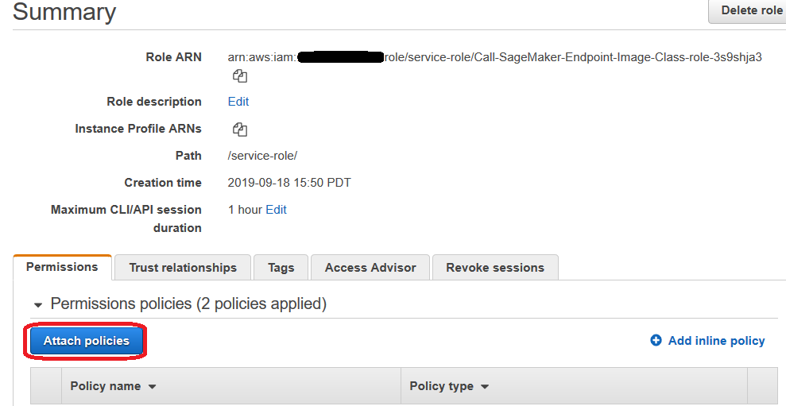

    Type **SageMakerFullAccess** on the search box. Select the checkbox once the policy name is  Click on the **Attach policy** button on the bottom of the page. 

    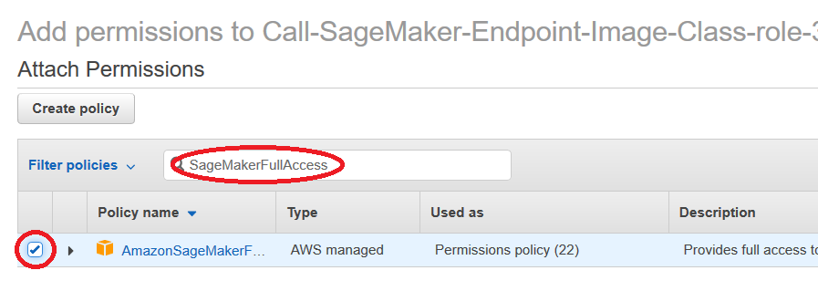

1. Copy and code from lambda_function.py and paste it into the code window.  

    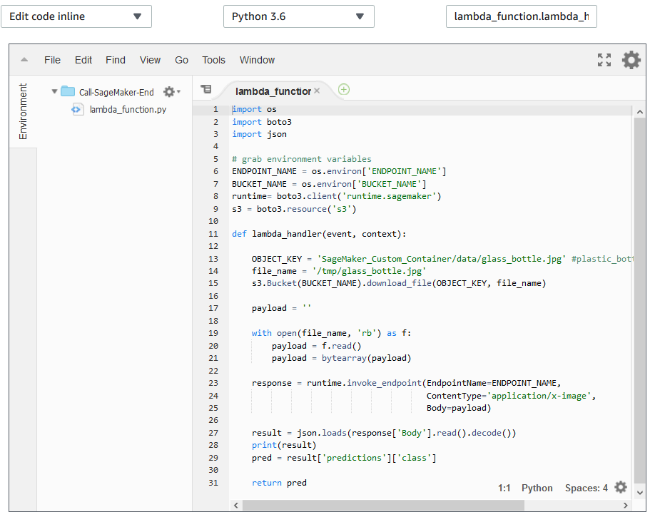

1. Create **ENDPOINT_NAME** envrionment variables and enter your Sagemaker endpoint name. Create **BUCKET_NAME** envrionment variables and enter your bucket name.

    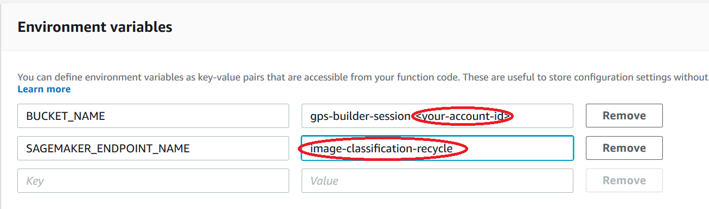

1. Increase the timeout on basic setting to be 30 seconds. Click on the **Save** on the upper right corner. 

    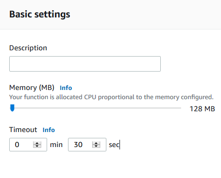

