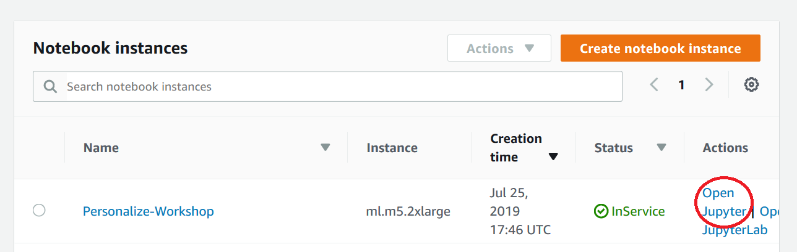

# Bring your own model with SageMaker by building a custom container

[Amazon SageMaker](https://aws.amazon.com/sagemaker/) provides every developer and data scientist with the ability to build, train, and deploy machine learning models quickly. Amazon SageMaker is a fully-managed service that covers the entire machine learning workflow to label and prepare your data, choose an algorithm, train the model, tune and optimize it for deployment, make predictions, and take action. Your models get to production faster with much less effort and lower cost.

In this session, you will build a custom container which contains a train-completed Pytorch model, and deploy it as a SageMaker endpoint. Your model is trained elsewhere like on premise perhaps, and you only want to use SageMaker to host the model. The session teaches how to do that. Pyorch/fast-ai model is provided for learning purposes. Once you know how to deploy a custom container with SageMaker, you can use the same approach to deploy the model trained with other machine learning framework.

## When should I build my own algorithm container?

You may not need to create a container to bring your own code to Amazon SageMaker. When you are using a framework (such as Apache MXNet or TensorFlow) that has direct support in SageMaker, you can simply supply the Python code that implements your algorithm using the SDK entry points for that framework. This set of frameworks is continually expanding, so we recommend that you check the current list if your algorithm is written in a common machine learning environment.

Even if there is direct SDK support for your environment or framework, you may find it more effective to build your own container. If the code that implements your algorithm is quite complex on its own or you need special additions to the framework, building your own container may be the right choice.

If there isn't direct SDK support for your environment, don't worry. You'll see in this walk-through that building your own container is quite straightforward.

## Example

We will show how to package a simple Pytorch image classification model which classifies types of recycle item. For simplification, there are 3 categories of recycle item, paper, glass bottle, and plastic bottle. The model predicts the image passed on is any of the 3 categories.   

 The example is purposefully fairly trivial since the point is to show the surrounding structure that you'll want to add to your own code to host it in Amazon SageMaker.

## Prerequisites for the Workshop

- Sign up for an AWS account

## Workshop Roadmap

- Launch Jupyter Notebook environment on Amazon SageMaker

## Launch Jupyter Notebook Environment on Amazon SageMaker

1. Click on **Amazon SageMaker** from the list of all services by entering Sagemaker into the **Find services** box. This will bring you to the Amazon SageMaker console homepage. 

1. To create a new Jupyter notebook instance, go to **Notebook instances** in the Amazon SageMaker console, and click the **Create notebook instance** button at the top of the browser window.

    

1. Type *Custom-Container-Workshop* into the **Notebook instance name** text box, and then *ml.m5.2xlarge* into the **Notebook instance type**. Note, there is not need to launch a large, compute-optimized C5 or GPU-based instance type.

    

    On the **Permission and encryption** section of the same page, choose **Create a new role** from the dropdown list. It will bring up the following popup window. Here, you can specify your S3 bucket or choose *Any S3 bucket* if you don't have S3 bucket created yet. For security purposes, we always recommend to choose *Specific S3 bucket* option but for the purpose of the lab, you could choose *Any S3 bucket*.  

    

    Lastly on this wizard, scroll down to the **Git repositories** section and choose *Clone a public Git repository to this notebook instance only* option. Then enter the URL of this workshop as shown below. Click on **Create notebook instance** button. 

    https://github.com/rumiio/SageMaker_Custom_Container.git   

    

＃TODO: add these permissions is simply to add the managed policy AmazonEC2ContainerRegistryFullAccess to the role that you used to start your notebook instance.

1. Wait until the notebook instance status is **InService**. This will take a few minutes once the creation process has started. Then click on **Open Jupyter**.

    